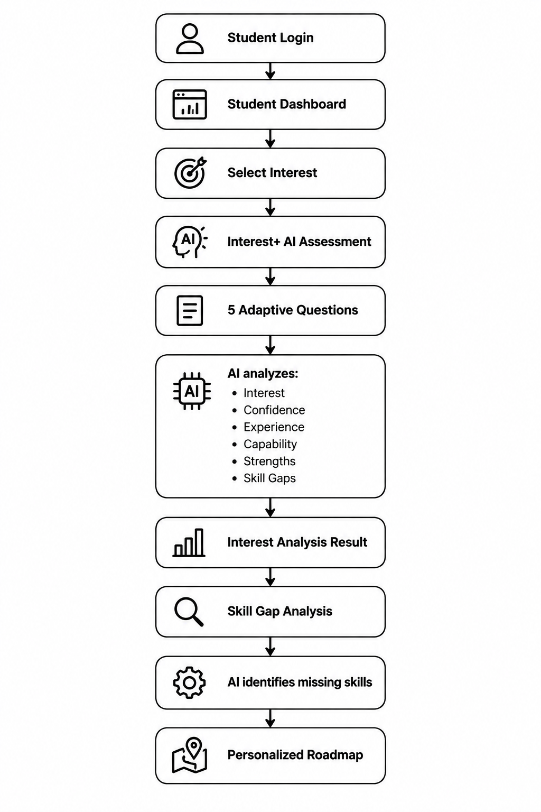

# 🎓 E.A.R.N.

### Early Academic Risk & Navigation — From Early Warning to Early Direction

An AI‑powered student intelligence platform that doesn't just flag who's falling behind — it explains why and shows every student where to go next.

[🚀 Live Demo](https://academic-early-warning-woad.vercel.app) · [📂 Repository](https://github.com/YashLakkas24/academic_early_warning)

---

## Table of contents

- [Problem](#problem)
- [Solution](#solution)
- [Key Features](#key-features)
- [How it works](#how-it-works)
  - [Teacher flow](#teacher-flow)
  - [Student flow](#student-flow)
- [AI & System Architecture](#ai--system-architecture)
- [Quick start (local)](#quick-start-local)
- [Environment variables](#environment-variables)
- [Core API routes](#core-api-routes)
- [Deployment](#deployment)
- [Demo credentials](#demo-credentials)
- [Screenshots](#screenshots)
- [Contributing](#contributing)
- [License & Contact](#license--contact)

---

## Problem

Education systems often monitor student performance but rarely capture ongoing growth or the root causes behind declining performance. The result is:

- Late interventions (noticed only after poor results)
- Dashboards that show symptoms (low marks, attendance) but not explanations
- One-time career guidance that doesn't adapt as students grow
- Separate systems for performance monitoring and student development

## Solution

E.A.R.N. connects deterministic academic early-warning with adaptive interest discovery and personalized next steps. The platform:

- Detects students at academic risk (Low / Medium / High) using auditable, deterministic scoring
- Uses generative AI to explain root causes and recommend interventions
- Runs an adaptive Interest+ assessment to discover student interests, confidence, experience, and capability
- Produces personalized directions, skill-gap analysis, and step-by-step roadmaps

## Key features

### Teacher
- Secure teacher authentication
- Deterministic Low / Medium / High risk classification
- Risk analytics dashboard and student drill-down
- AI-generated root-cause explanations and recommendations

### Student
- Secure student authentication
- Interest+ adaptive assessment (structured + free-text)
- Deterministic scoring: Interest / Confidence / Experience / Capability
- AI-generated strengths, skill-gap identification, potential directions, and roadmaps

## How it works

### Teacher flow

1. Teacher logs in
2. Student academic data is processed by the deterministic risk engine
3. Dashboard shows Low / Medium / High buckets and analytics
4. Teacher selects a student → AI explains leading factors and suggests interventions

### Student flow

1. Student logs in and selects an interest
2. Interest+ session begins (adaptive questions via AI)
3. Student answers structured or free-text questions
4. Deterministic scoring computes quantitative profile
5. Generative AI produces qualitative analysis, strengths, skill gaps, and personalized next steps

---
## 📸 Screenshots / Demo

A quick visual walkthrough of both the teacher and student sides of E.A.R.N — from login, to risk analytics, to the AI-driven Interest+ journey.

### 🔐 Login

<p align="center">
  
</p>

<p align="center"><i>Role-aware login — students and teachers sign into the same platform through separate, secure flows.</i></p>

<br/>

### 👨‍🏫 Teacher Side — Risk Detection & Analytics

<table>
  <tr>
    <td width="50%" align="center">
      <br/>
      <sub><b>Teacher Home</b> — "Turn Academic Signals Into Action"</sub>
    </td>
    <td width="50%" align="center">
      <br/>
      <sub><b>Academic Risk Analytics</b> — risk distribution & drill-down by High / Medium / Low</sub>
    </td>
  </tr>
</table>

<br/>

### 🎓 Student Side — Dashboard & Interest+ Discovery

<table>
  <tr>
    <td width="50%" align="center">
      <br/>
      <sub><b>Student Workspace</b> — academic snapshot + AI-generated interest profile</sub>
    </td>
    <td width="50%" align="center">
      <br/>
      <sub><b>Interest+ Discovery</b> — adaptive interest selection that drives follow-up questions</sub>
    </td>
  </tr>
</table>

<br/>

### 🗺️ End-to-End Student Journey

<p align="center">
  
</p>

<p align="center"><i>Login → Dashboard → Select Interest → Interest+ AI Assessment → Adaptive Questions → AI Analysis (interest, confidence, experience, capability, strengths, skill gaps) → Skill Gap Analysis → Personalized Roadmap.</i></p>


## AI & system architecture

E.A.R.N. separates responsibilities across three layers:

- Deterministic layer — measurable calculations (risk scores, thresholds, interest scoring)
- Adaptive decision layer — chooses next questions and adapts the assessment path
- Generative AI layer — OpenAI for adaptive question generation, interpreting free-text, explanations, and human-readable outputs

The LLM is used only for interpretation and natural-language output; it never replaces the deterministic risk calculation.

System overview (high level):

```text
Frontend (React + Vite)
        ↓ HTTPS/JSON
Backend (FastAPI)
  ├─ PostgreSQL (users, students, interests, quiz answers, analysis)
  └─ OpenAI API (adaptive Qs, qualitative analysis)
Auth: Firebase Authentication → Firebase ID token → Backend
```

---

## Quick start (local)

### Prerequisites
- Python 3.10+
- Node.js 18+
- PostgreSQL
- Firebase project
- OpenAI API key

### 1. Clone

```bash
git clone https://github.com/YashLakkas24/academic_early_warning.git
cd academic_early_warning
```

### 2. Backend

```bash
cd backend
python -m venv venv
# macOS / Linux
source venv/bin/activate
# Windows (PowerShell)
# .\venv\Scripts\Activate.ps1
pip install -r ../requirements.txt
PYTHONPATH=.. uvicorn main:app --reload
```

### 3. Frontend (in a separate terminal)

```bash
cd frontend
npm install
npm run dev
```

- Frontend: http://localhost:5173
- Backend:  http://localhost:8000

---

## Environment variables

### Backend
- DATABASE_URL
- OPENAI_API_KEY
- FIREBASE_PROJECT_ID
- FIREBASE_CLIENT_EMAIL
- FIREBASE_PRIVATE_KEY

### Frontend
- VITE_API_URL (e.g. http://localhost:8000)

> Never commit real API keys, DB passwords, or private keys to the repo.

---

## Core API routes

### Authentication
- POST /api/auth/login

### Student
- GET  /api/students/{student_id}

### Interest+
- GET  /api/students/{student_id}/interests/status
- POST /api/students/{student_id}/interests
- POST /api/students/{student_id}/interest-session/start
- POST /api/students/{student_id}/interest-session/answer
- GET  /api/students/{student_id}/interest-analysis
- GET  /api/students/{student_id}/career-directions
- GET  /api/students/{student_id}/skill-gap
- GET  /api/students/{student_id}/roadmap
- POST /api/students/{student_id}/career-pivot/analyze

### Teacher
- GET /api/teacher/analytics

---

## Deployment

- Frontend: Vercel — https://academic-early-warning-woad.vercel.app
- Backend:  Render — https://academic-early-warning.onrender.com
- DB:      Render PostgreSQL
- Auth:    Firebase
- AI:      OpenAI

Render start command (backend):

```bash
cd backend && PYTHONPATH=.. uvicorn main:app --host 0.0.0.0 --port $PORT
```

---

## Demo credentials

These are intended for evaluation/demo only.

### Student
- STU001 / student001
- STU002 / student002

### Teacher
- TCH001 / teacher001

---

## Screenshots

All UI images are in docs/images/ (login, teacher dashboard, student workspace, Interest+).

---

## Contributing

Contributions are welcome. Suggested workflow:
1. Fork the repository and create a short-lived feature branch
2. Implement changes and add tests where appropriate
3. Open a pull request with a clear description and link to any related issue

If you want help prioritizing or a walkthrough, open an issue or contact the maintainers.

---

## License & contact

This project is intended for hackathon / academic use. If an `LICENSE` file (e.g. MIT) is present, that governs use.

Maintainers
- Vaibhav Kulkarni
- Yash Lakkas
- Isha Samant

Contact: See repository profile for contact details.
