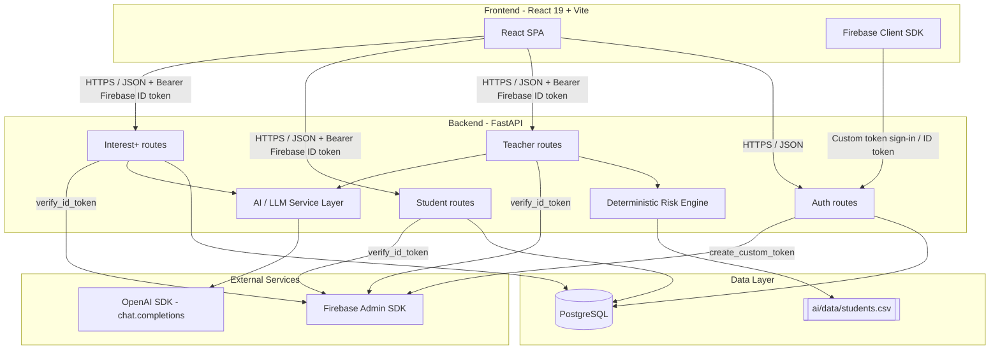
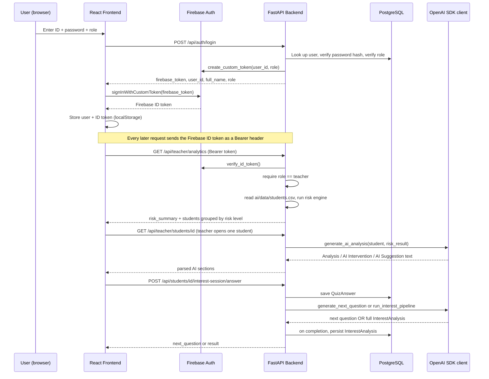
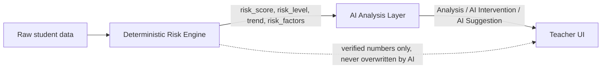
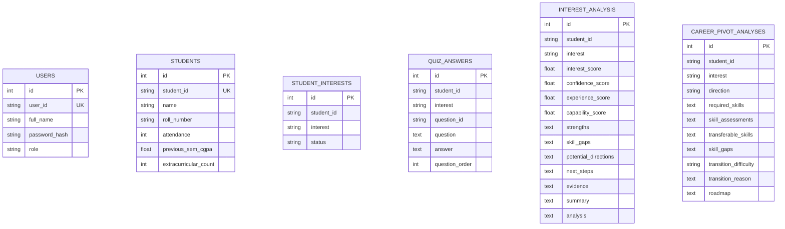
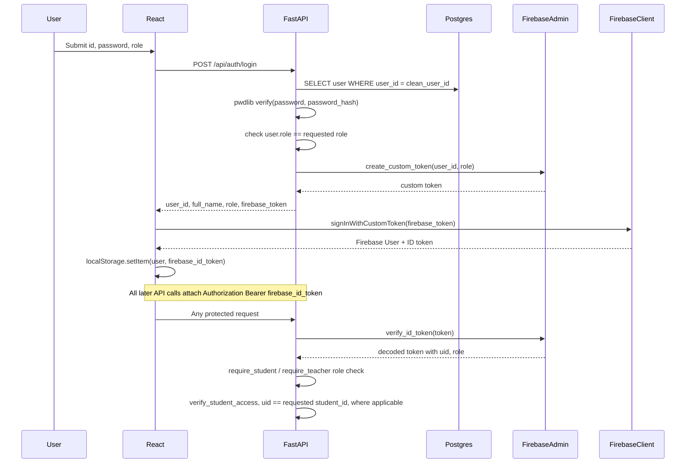
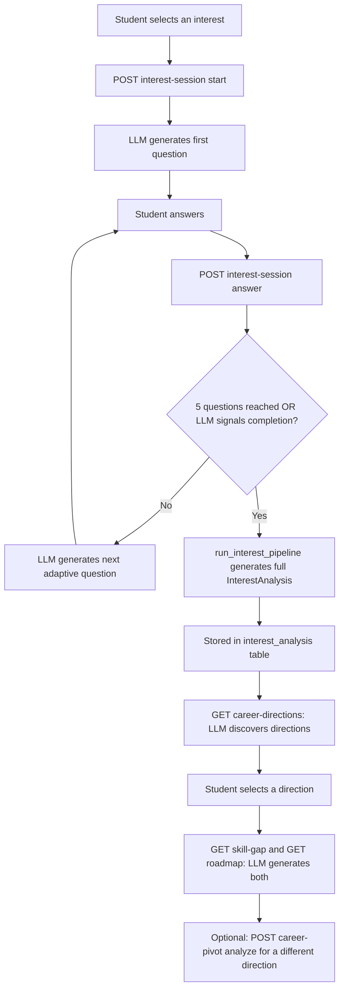

# 🎓 E.A.R.N. — Early Academic Risk & Navigation

**An AI-assisted platform that detects academic risk deterministically and turns it into explainable, actionable guidance for teachers — while helping students turn their interests into a concrete skill roadmap.**

[]()
[]()
[]()
[]()
[-412991)]()

> **Core principle:** deterministic risk calculation first; AI explanation and personalized guidance second.

### At a glance

| Audience | What E.A.R.N. provides |
|---|---|
| 👨‍🏫 Teachers | Explainable academic risk detection, analytics, interventions |
| 👨‍🎓 Students | Adaptive Interest+, career directions, skill gaps, roadmaps |
| 🧠 AI layer | Adaptive questioning, explanation, analysis, career/skill guidance |
| 🔐 Security | PostgreSQL credential/role checks + Firebase bearer-token verification |


---

## Table of Contents

1. [Problem Statement](#1-problem-statement)
2. [Solution Overview](#2-solution-overview)
3. [Key Features](#3-key-features)
4. [System Architecture](#4-system-architecture)
5. [End-to-End Data Flow](#5-end-to-end-data-flow)
6. [Frontend Architecture](#6-frontend-architecture)
7. [Backend Architecture](#7-backend-architecture)
8. [AI Architecture](#8-ai-architecture)
9. [Database Design](#9-database-design)
10. [Authentication Flow](#10-authentication-flow)
11. [Teacher Workflow](#11-teacher-workflow)
12. [Student Workflow](#12-student-workflow)
13. [Interest+ Adaptive Assessment Workflow](#13-interest-adaptive-assessment-workflow)
14. [AI Functionality Summary](#14-ai-functionality-summary)
15. [Tech Stack](#15-tech-stack)
16. [Project Structure](#16-project-structure)
17. [API Overview](#17-api-overview)
18. [Environment Variables](#18-environment-variables)
19. [Installation & Setup](#19-installation--setup)
20. [Running the Project Locally](#20-running-the-project-locally)
21. [Database Setup & Seed Process](#21-database-setup--seed-process)
22. [AI / API Configuration](#22-ai--api-configuration)
23. [Example Workflow](#23-example-workflow)
24. [Limitations / Known Constraints](#24-limitations--known-constraints)
25. [Future Improvements](#25-future-improvements)
26. [Team & Contribution](#26-team--contribution)

---

## 1. Problem Statement

College academic monitoring is usually reactive and shallow:

- Struggling students are noticed **after** results are already poor.
- Dashboards show *symptoms* (low marks, low attendance) but never *why* it's happening.
- Career/interest guidance, where it exists, is a one-time event that never adapts as the student grows.
- Academic risk tracking and student development/guidance live in completely separate systems.

## 2. Solution Overview

E.A.R.N. connects two things that are normally built as separate tools:

1. **A deterministic academic risk engine** that scores every student as `LOW` / `MEDIUM` / `HIGH` risk from measurable data (attendance, marks, test-score trend, etc.), with a transparent, auditable formula — no black box.
2. **An AI layer** that sits *on top of* those verified numbers to explain *why* a student is at risk and suggest a concrete faculty intervention — the AI is explicitly instructed never to alter the computed score, level, or trend.
3. **A student-facing adaptive assessment ("Interest+")** where an LLM asks a short, dynamically-generated sequence of questions about a chosen interest area, scores the student's interest/confidence/experience, and produces AI-generated strengths, skill gaps, career directions, and a step-by-step roadmap.

The result: teachers get an early, explainable warning system; students get a personalized, evolving guidance layer — on one platform, with one authentication system.

## 3. Key Features

### Teacher-facing
- Secure, role-verified login (teacher credentials only unlock teacher routes)
- Deterministic `LOW` / `MEDIUM` / `HIGH` risk classification for every student in the dataset
- Risk analytics dashboard: risk-level summary counts and a performance-trend view, computed **without** any AI calls (fast to load)
- Per-student drill-down that triggers an AI-generated analysis, a two-line "AI Intervention," and a one-line "AI Suggestion" — generated only for the specific student the teacher opens

### Student-facing
- Secure, role-verified login
- Personal academic profile (attendance, previous-semester CGPA, extracurricular count)
- **Interest+**: select an interest from a fixed list, then answer up to 5 adaptively-generated questions (scale / single-choice / multiple-choice / text)
- AI-generated Interest+ analysis: interest score, confidence score, experience score, capability score, strengths, skill gaps, potential directions, next steps, evidence, and summary
- AI-discovered career directions based on the Interest+ analysis
- AI-generated skill-gap analysis and a step-by-step personalized roadmap for a chosen career direction
- On-demand "career pivot" re-analysis for a specific direction

## 4. System Architecture



**Notable architectural detail:** the platform reads student *academic* data from **two different sources** depending on the feature:
- `GET /api/students/{id}` (student's own profile) reads from the PostgreSQL `students` table.
- All teacher risk analytics (`/api/teacher/*`) read directly from `ai/data/students.csv` via `pandas`, independent of the database.

Both are populated from the same CSV at setup time (see [Database Setup & Seed Process](#21-database-setup--seed-process)), but at runtime they are not the same query path.

## 5. End-to-End Data Flow



## 6. Frontend Architecture

- **Framework:** React 19 (function components, hooks) bootstrapped with **Vite**, routed with **react-router-dom v7**.
- **Entry point:** `main.jsx` → `App.jsx`, which defines all routes. Public routes (`/`, `/login`) and role-gated routes for `teacher/*` and `student/*`, each wrapped in a `<ProtectedRoute allowedRole="...">` component.
- **Route protection (`ProtectedRoute.jsx`):** subscribes to Firebase's `onAuthStateChanged`, checks for a locally-stored `user` object, and redirects to `/` or to the correct dashboard if the logged-in user's role doesn't match the route.
- **Services layer (`src/services/`):** a thin fetch-based API client per domain —
  - `authService.js` — drives the full login flow (FastAPI → Firebase custom token → Firebase sign-in → ID token → localStorage).
  - `studentService.js` — calls every `/api/students/...` endpoint (profile, Interest+ status/options/session/analysis, career directions, skill gap, roadmap, career-pivot analyze).
  - `teacherService.js` — calls `/api/teacher/analytics` and normalizes/derives risk-summary, performance-trend, and student-list views from it client-side; caches the analytics response in memory (`clearTeacherAnalyticsCache` / `refreshTeacherAnalytics`) so re-opening the dashboard doesn't re-fetch unnecessarily.
  - `mockData.js` — development-only placeholder data, explicitly not imported by any page/component (kept for reference per its own header comment).
- **Pages:** `Landing` (marketing/explainer page), `Login`, `teachers-dash/` (`TeacherWelcome`, `TeacherAnalytics`), `Student/` (`StudentDashboard`, `InterestPlus`, `InterestQuestions`, `InterestResult`, `SkillGap`, `StudentRoadmap`).
- **Charts:** teacher analytics visualizations (`RiskDistributionChart`, `PerformanceTrendChart`) are built with **Recharts**.
- **Auth client:** `firebase.js` initializes the Firebase Web SDK with the project's public client config (the `apiKey` here is a Firebase **client identifier**, not a secret — Firebase security relies on backend token verification and security rules, not on hiding this value).

## 7. Backend Architecture

- **Framework:** FastAPI, single app instance in `backend/main.py`.
- **CORS:** explicitly allows `localhost:5173/5174` (Vite dev server) and any `*.vercel.app` subdomain via `allow_origin_regex`.
- **Startup:** imports every SQLAlchemy model, then calls `Base.metadata.create_all(bind=engine)` so all tables exist on boot.
- **Routers** (all mounted in `main.py`):

  | Router | Prefix | File |
  |---|---|---|
  | Authentication | `/api/auth` | `routes/auth.py` |
  | Teacher | `/api/teacher` | `routes/teacher.py` |
  | Student | `/api/students` | `routes/student.py` |
  | Interest+ | `/api/students` | `routes/interest.py` |
  | Interest options | `/api/interests` | `routes/interest_options.py` |

- **Database session pattern:** every router defines its own `get_db()` generator dependency (`SessionLocal()` → `yield` → `close()`), used via FastAPI `Depends`.
- **Authorization pattern:** every protected route depends on `require_student` or `require_teacher` (from `auth_dependencies.py`), which in turn depends on `get_current_user` (verifies the Firebase ID token). Student-scoped routes additionally call a local `verify_student_access(student_id, current_user)` check so a logged-in student can only ever read/write **their own** `student_id` — enforced by comparing the Firebase token's `uid` to the requested `student_id`.
- **Teacher analytics caching:** `routes/teacher.py` keeps an in-process `analysis_cache` of the deterministic risk results so the analytics endpoints don't re-read and re-score the CSV on every request; `POST /api/teacher/clear-cache` resets it. AI analysis is **never** part of this cache — it is generated fresh (per the code's own comments) only when a specific student is opened.

## 8. AI Architecture

E.A.R.N. deliberately separates **what is calculated** from **what is explained**:



- **Deterministic layer** (`ai/risk_engine/`): pure Python/pandas/numpy — no LLM call. Computes the risk score, LOW/MEDIUM/HIGH bucket, and score/test trend.
- **Generative layer** (`ai/risk_engine/ai_analysis.py`, `ai_student/llm/`): calls the OpenAI SDK's `chat.completions.create`. The prompt in `ai_analysis.py` explicitly hands the model the *already-computed* risk score, level, trend, and risk factors and instructs it, in numbered rules, that it must **never** change those values, must not invent facts, must not diagnose the student, and must avoid alarmist language — its only job is to explain the verified numbers and produce a two-line intervention plus a one-line suggestion in a fixed text format that the backend then parses with `extract_ai_section` / `extract_ai_intervention` / `extract_ai_suggestion`.
- **Interest+ generative pipeline** (`ai_student/`): a second, independent use of the same LLM client for a completely different job — generating adaptive quiz questions, scoring/qualitative analysis of a student's interest, career-direction discovery, skill discovery/assessment, transferable-skill identification, skill-gap analysis, and a transition roadmap. Response shapes are enforced with Pydantic schemas (`ai_student/llm/schemas.py`, `ai_student/career_pivot/schemas.py`) and a `parse_json_from_llm()` helper that strips markdown fences and extracts the JSON payload before validation.
- **Model configuration:** the default model name is read from the `AI_MODEL` environment variable (`ai_student/llm/service.py`) or hardcoded as `"gpt-5.4-mini"` (`ai_analysis.py`), passed to `client.chat.completions.create(...)`.
- **Client wiring:** `ai_student/llm/client.py` constructs an `OpenAI(api_key=OPENAI_API_KEY, base_url="https://api.openai.com/v1")` client. See [Limitations](#24-limitations--known-constraints) for a discrepancy between this and the project's own `.env.example`.

## 9. Database Design

PostgreSQL, accessed via SQLAlchemy ORM (`backend/models.py`).



Notes on the design as implemented:
- `USERS` is the login/identity table (used by `/api/auth/login`); `STUDENTS` is a separate academic-profile table. They are linked implicitly by matching `user_id` / `student_id` values (both are populated from the same `student_id` column in `ai/data/students.csv`) — there is no SQL foreign key between them.
- JSON-shaped AI output (skills, gaps, roadmap steps, etc.) is stored as `Text` columns containing serialized JSON, not as normalized relational structures — the model file's own comments note this is intentional for now ("we can create separate tables ... later, if required").
- `student_id`, `interest`, and `question_id` are indexed on `QUIZ_ANSWERS` and `INTEREST_ANALYSIS` to support per-student, per-interest lookups.

## 10. Authentication Flow

Authentication is a **two-step, two-provider** design: PostgreSQL is the source of truth for credentials and roles; Firebase is used purely as the bearer-token mechanism for the FastAPI backend.



- Passwords are hashed with **pwdlib**'s recommended (Argon2) hasher — never stored or compared in plaintext.
- The role the user *selected on the login form* must match the role stored in Postgres for that `user_id`, or login fails with `401`.
- The Firebase **custom token** minted at login encodes the role as a custom claim; every protected backend route re-verifies the **ID token** server-side via `firebase_auth.verify_id_token` — the frontend's claim of a role is never trusted on its own.
- Student-scoped endpoints additionally compare the token's `uid` against the `student_id` in the URL, so a student can only ever operate on their own record.

## 11. Teacher Workflow

1. Teacher logs in (`role="teacher"`) and lands on `/teacher/dashboard`.
2. `TeacherAnalytics` calls `GET /api/teacher/analytics`, which loads `ai/data/students.csv`, runs the deterministic risk engine for every row, and returns risk counts plus students grouped by `HIGH` / `MEDIUM` / `LOW` — **no AI is invoked** for this view, and the result is cached in-process.
3. The dashboard renders a risk-distribution chart and a performance-trend chart from that response.
4. When the teacher clicks into a specific student, the frontend calls `GET /api/teacher/students/{student_id}`, which — and only at this point — calls `generate_ai_analysis()` for that one student, parses the model's response into an `Analysis` paragraph, a two-line `AI Intervention`, and a one-line `AI Suggestion`, and returns them alongside the already-computed risk level and trend.
5. If the AI call fails for any reason, the backend falls back to a deterministic, risk-factor-based intervention text so the UI is never left empty.

## 12. Student Workflow

1. Student logs in (`role="student"`) and lands on `/student/dashboard`.
2. `GET /api/students/{student_id}` returns their academic profile (name, roll number, attendance, previous-semester CGPA, extracurricular count) from the `students` table — access is rejected with `403` unless the authenticated `uid` matches the requested `student_id`.
3. From the dashboard the student can enter the **Interest+** flow (see next section), and afterward view AI-discovered career directions, a skill-gap analysis, and a personalized roadmap for a chosen direction.

## 13. Interest+ Adaptive Assessment Workflow



- Question order is influenced by `ai_student/quiz/adaptive_logic.py`'s `choose_next_question`, which defines a logical progression (`interest_level → confidence → experience → experience_detail → motivation → development_goal`), but the actual question generation, wording, response type, and options are produced live by the LLM (`generate_next_question`), which also decides when enough information has been gathered.
- **Hard limit:** regardless of what the LLM decides, the flow (`InterestPlusFlow` in `ai_student/interest_plus/flow.py`) enforces a maximum of **5 questions** per session.
- Each generated question is validated server-side (`validate_question` in `ai_student/quiz/question_engine.py`) against an allowed set of response types (`scale`, `single_choice`, `multiple_choice`, `text`) before being sent to the frontend.
- Scoring helpers (`ai_student/interest_analysis/scoring.py`) convert a 1–5 scale answer to a 0–100 score and map qualitative experience labels (`never`/`once`/`occasionally`/`frequently`/`regularly`) to a 0–100 score; the final qualitative analysis (strengths, skill gaps, potential directions, next steps, evidence, summary) is produced by the LLM and validated against a Pydantic schema.

## 14. AI Functionality Summary

| Function | File | Purpose |
|---|---|---|
| `generate_ai_analysis` | `ai/risk_engine/ai_analysis.py` | Explains a student's already-computed risk result for the teacher dashboard |
| `generate_next_question` | `ai_student/llm/service.py` | Produces the next adaptive Interest+ question |
| `generate_interest_analysis` | `ai_student/llm/service.py` | Produces the qualitative Interest+ analysis (strengths, gaps, directions, etc.) |
| `generate_direction_discovery` | `ai_student/llm/service.py` | Discovers candidate career directions from the Interest+ analysis |
| `generate_skill_discovery` / `generate_skill_assessment` | `ai_student/llm/service.py` | Identify and assess skills relevant to a chosen direction |
| `generate_transferable_skills` | `ai_student/llm/service.py` | Identifies skills that transfer from existing experience |
| `generate_skill_gap_analysis` | `ai_student/llm/service.py` | Produces the skill-gap analysis for a direction |
| `generate_transition_roadmap` | `ai_student/llm/service.py` | Produces the step-by-step learning roadmap |

All of the above go through `safe_chat_completion()` in `ai_student/llm/service.py`, which wraps `client.chat.completions.create(...)` with the OpenAI SDK's typed exceptions (`RateLimitError`, `APIError`, `InternalServerError`, `APIConnectionError`, `NotFoundError`), and through `parse_json_from_llm()`, which strips markdown fences/preambles before the JSON is validated against a Pydantic schema.

## 15. Tech Stack

**Frontend**
- React 19, React Router DOM 7
- Vite 8 (dev server / build)
- Firebase JS SDK 12 (client auth)
- Recharts 3 (charts)
- lucide-react (icons)
- oxlint (linting)

**Backend**
- FastAPI 0.141
- Uvicorn 0.52 (ASGI server)
- SQLAlchemy 2.0 (ORM)
- psycopg2-binary (PostgreSQL driver)
- Pydantic 2.13 (request/response + AI-output validation)
- pwdlib[argon2] (password hashing)
- firebase-admin 7.5 (server-side token verification & custom token issuance)
- pandas 3.0 (CSV dataset processing for the risk engine)
- openai 3.3 (LLM client SDK)
- python-dotenv (environment loading)

**Database & Auth Infra**
- PostgreSQL
- Firebase Authentication

**AI**
- OpenAI SDK's `chat.completions` interface (model name configurable via `AI_MODEL`; see [Limitations](#24-limitations--known-constraints) regarding the actual configured provider/endpoint)

**Deployment (per README/config found in repo)**
- Frontend: Vercel (`frontend/vercel.json` rewrites all paths to `index.html` for SPA routing)
- Backend: Render (per the project's own prior documentation and the Render start command it documents)

## 16. Project Structure

```
academic_early_warning/
├── ai/
│   ├── data/
│   │   └── students.csv               # Source dataset for the risk engine + DB seeding
│   └── risk_engine/
│       ├── risk_engine.py             # Orchestrates per-student / per-dataset analysis
│       ├── risk_calculator.py         # Deterministic weighted risk score + LOW/MEDIUM/HIGH bucket
│       ├── risk_factors.py            # Human-readable risk factor extraction
│       ├── risk_contribution.py       # Per-factor contribution breakdown
│       ├── trend.py                   # Linear-fit trend (DECLINING/STABLE/IMPROVING) over test scores
│       ├── explainability.py          # Deterministic explanation text
│       ├── ai_analysis.py             # LLM call that explains the verified risk result
│       └── validator.py               # Dataset validation
├── ai_student/
│   ├── llm/
│   │   ├── client.py                  # OpenAI client instantiation
│   │   ├── service.py                 # All LLM-calling functions + JSON parsing/validation
│   │   ├── prompts.py                 # System prompts
│   │   └── schemas.py                 # Pydantic schemas for LLM output
│   ├── quiz/
│   │   ├── adaptive_logic.py          # Question ordering heuristics
│   │   ├── question_engine.py         # Validates LLM-generated questions
│   │   └── schemas.py                 # QuizSession / QuizAnswer models
│   ├── interest_plus/
│   │   └── flow.py                    # Orchestrates the 5-question adaptive session
│   ├── interest_analysis/
│   │   ├── analyzer.py                # Builds the LLM prompt for interest analysis
│   │   ├── scoring.py                 # Scale/experience -> numeric score helpers
│   │   └── pipeline.py                # Runs the full interest analysis pipeline
│   └── career_pivot/
│       ├── pipeline.py                # Career-direction discovery + skill-gap/roadmap pipeline
│       ├── prompts.py                 # System prompts for career-pivot stages
│       └── schemas.py                 # Pydantic schemas for career-pivot output
├── backend/
│   ├── main.py                        # FastAPI app, CORS, router registration
│   ├── database.py                    # SQLAlchemy engine/session setup
│   ├── models.py                      # ORM models (Users, Students, Interests, Quiz, Analysis)
│   ├── schemas.py                     # LoginRequest / LoginResponse
│   ├── auth_dependencies.py           # Firebase token verification + role guards
│   ├── firebase_admin_config.py       # Firebase Admin SDK initialization
│   ├── create_users.py                # Seeds Users table (students + teachers) from CSV
│   ├── create_students.py             # Seeds Students table from CSV
│   ├── create_interest_tables.py      # Creates Interest+ tables
│   ├── reset_students.py              # Drops/recreates the Students table
│   └── routes/
│       ├── auth.py                    # POST /api/auth/login
│       ├── teacher.py                 # /api/teacher/* (analytics, per-student AI analysis)
│       ├── student.py                 # GET /api/students/{id}
│       ├── interest.py                # /api/students/{id}/interests..., Interest+, career-pivot
│       └── interest_options.py        # GET /api/interests/options
├── frontend/
│   ├── src/
│   │   ├── pages/                     # Landing, Login, Student/*, teachers-dash/*
│   │   ├── components/                # Navbar, ProtectedRoute, teacher/* charts, etc.
│   │   ├── services/                  # authService, studentService, teacherService
│   │   ├── firebase.js                # Firebase client config
│   │   └── App.jsx                    # Route definitions
│   ├── vercel.json
│   └── vite.config.js
├── docs/images/                       # Screenshots used in this README/marketing
├── requirements.txt                   # Backend Python dependencies
└── README.md
```

## 17. API Overview

All routes below are the ones actually registered in `backend/main.py`. Unless noted, requests must include `Authorization: Bearer <firebase_id_token>`.

### Authentication — `/api/auth`
| Method | Path | Auth | Description |
|---|---|---|---|
| POST | `/api/auth/login` | None | Verifies `{user_id, password, role}` against PostgreSQL, mints a Firebase custom token |

### Students — `/api/students`
| Method | Path | Auth | Description |
|---|---|---|---|
| GET | `/api/students/{student_id}` | Student (self only) | Academic profile |
| GET | `/api/students/{student_id}/interests/status` | Student (self only) | Whether Interest+ has been completed |
| POST | `/api/students/{student_id}/interests` | Student (self only) | Save a selected interest |
| POST | `/api/students/{student_id}/interest-session/start` | Student (self only) | Start/resume an adaptive session (`?reset=`) |
| POST | `/api/students/{student_id}/interest-session/answer` | Student (self only) | Submit an answer, get the next question or the final result |
| GET | `/api/students/{student_id}/interest-analysis` | Student (self only) | Retrieve the stored Interest+ analysis |
| GET | `/api/students/{student_id}/career-directions` | Student (self only) | AI-discovered career directions |
| GET | `/api/students/{student_id}/skill-gap` | Student (self only) | Skill-gap analysis (`?direction=&force_refresh=`) |
| GET | `/api/students/{student_id}/roadmap` | Student (self only) | Personalized roadmap (`?direction=&force_refresh=`) |
| POST | `/api/students/{student_id}/career-pivot/analyze` | Student (self only) | Trigger analysis for a specific direction |

### Interest options — `/api/interests`
| Method | Path | Auth | Description |
|---|---|---|---|
| GET | `/api/interests/options` | None | Returns the fixed list of selectable interests |

### Teacher — `/api/teacher`
| Method | Path | Auth | Description |
|---|---|---|---|
| GET | `/api/teacher/analytics` | Teacher | Risk summary + students grouped by risk level (no AI) |
| GET | `/api/teacher/risk-summary` | Teacher | Just the high/medium/low counts |
| GET | `/api/teacher/performance-trend` | Teacher | Per-student trend data |
| GET | `/api/teacher/students?risk=HIGH\|MEDIUM\|LOW` | Teacher | Student list filtered by risk level |
| GET | `/api/teacher/students/{student_id}` | Teacher | Full detail **+ AI analysis** for one student |
| GET | `/api/teacher/report` | Teacher | Raw CSV dataset as JSON |
| POST | `/api/teacher/clear-cache` | Teacher | Clears the in-process deterministic-analysis cache |

### Utility
| Method | Path | Auth | Description |
|---|---|---|---|
| GET | `/` | None | Health message |
| GET | `/api/test` | None | Static status payload |
| GET | `/api/test-db` | None | Executes `SELECT 1` to confirm DB connectivity |

## 18. Environment Variables

Taken directly from `backend/.env.example` and the code that reads `os.getenv(...)`. **No real values are included here.**

### Backend (`.env`, loaded from the project root or `backend/`)
| Variable | Used by | Purpose |
|---|---|---|
| `DATABASE_URL` | `backend/database.py` | PostgreSQL connection string |
| `FIREBASE_PROJECT_ID` | `backend/firebase_admin_config.py` | Firebase service-account project ID |
| `FIREBASE_CLIENT_EMAIL` | `backend/firebase_admin_config.py` | Firebase service-account client email |
| `FIREBASE_PRIVATE_KEY` | `backend/firebase_admin_config.py` | Firebase service-account private key |
| `OPENAI_API_KEY` | `ai/risk_engine/ai_analysis.py`, `ai_student/llm/client.py` | Auth for the OpenAI SDK client |
| `AI_MODEL` | `ai_student/llm/service.py` | Overrides the default model name (`gpt-5.4-mini` if unset) |
| `GEMINI_API_KEY`, `AI_BASE_URL` | Listed in `.env.example` only | Intended for a Gemini OpenAI-compatible endpoint — **see Limitations** |

### Frontend (`frontend/.env`)
| Variable | Used by | Purpose |
|---|---|---|
| `VITE_API_URL` | `authService.js`, `studentService.js`, `teacherService.js` | Base URL of the FastAPI backend |

> Never commit real API keys, database passwords, or private keys — `.gitignore` already excludes `.env` and `firebase-service-account.json`.

## 19. Installation & Setup

### Prerequisites
- Python 3.10+
- Node.js 18+
- PostgreSQL (running instance + a created database)
- A Firebase project with Authentication enabled and a service-account key
- An OpenAI-SDK-compatible API key (see [AI / API Configuration](#22-ai--api-configuration))

### Clone
```bash
git clone https://github.com/YashLakkas24/academic_early_warning.git
cd academic_early_warning
```

### Backend setup
```bash
cd backend
python -m venv venv

# macOS / Linux
source venv/bin/activate
# Windows (PowerShell)
# .\venv\Scripts\Activate.ps1

pip install -r ../requirements.txt
```

Create `backend/.env` (copy from `backend/.env.example`) and fill in `DATABASE_URL`, `FIREBASE_PROJECT_ID`, `FIREBASE_CLIENT_EMAIL`, `FIREBASE_PRIVATE_KEY`, and your model API key (see [AI / API Configuration](#22-ai--api-configuration)).

### Frontend setup
```bash
cd frontend
npm install
```

Create `frontend/.env` with:
```
VITE_API_URL=http://localhost:8000
```

## 20. Running the Project Locally

**Backend** (from `backend/`, with the virtualenv active):
```bash
PYTHONPATH=.. uvicorn main:app --reload
```
Backend will be available at `http://localhost:8000`.

**Frontend** (in a separate terminal, from `frontend/`):
```bash
npm run dev
```
Frontend will be available at `http://localhost:5173`.

## 21. Database Setup & Seed Process

`backend/main.py` calls `Base.metadata.create_all(bind=engine)` on startup, so all tables (`users`, `students`, `student_interests`, `quiz_answers`, `interest_analysis`, `career_pivot_analyses`) are created automatically the first time the backend runs against an empty database.

To populate the `users` and `students` tables from `ai/data/students.csv`, run these one-off scripts (from `backend/`, with the virtualenv active and `.env` configured):

```bash
python create_users.py             # Creates/syncs student + teacher login accounts from the CSV
python create_students.py          # Creates/syncs academic profile rows from the CSV
python create_interest_tables.py   # (optional) explicitly (re)creates the Interest+ tables
```

Notes on what these scripts actually do:
- `create_users.py` creates one `User` row per CSV row with `role="student"` and a generated password of `student` + the **last 3 characters of the student ID** (e.g. `STU001` → `student001`). It also inserts five hardcoded teacher accounts (`TCH001`–`TCH005`, passwords `teacher001`–`teacher005`).
- `create_students.py` populates the `students` table (name, `roll_number` = last 3 chars of `student_id`, attendance, previous-semester CGPA, extracurricular count) from the same CSV, updating existing rows if the `student_id` already exists.
- `reset_students.py` drops and recreates only the `students` table — useful if you need to re-seed that table from scratch.

## 22. AI / API Configuration

The project's committed `.env.example` documents:
```
GEMINI_API_KEY=your_gemini_api_key_here
AI_BASE_URL=https://generativelanguage.googleapis.com/v1beta/openai/
```
— i.e., the intended setup is Google's Gemini API accessed through its **OpenAI-compatible endpoint**, using the `openai` Python SDK. Code comments inside `ai_student/interest_plus/flow.py` also refer to the model as "Gemini."

As currently wired, however, `ai_student/llm/client.py` reads `OPENAI_API_KEY` and hardcodes `base_url="https://api.openai.com/v1"`, and `ai/risk_engine/ai_analysis.py` also reads `OPENAI_API_KEY` with no custom `base_url`. **To run the AI features as the code is currently written, set a real `OPENAI_API_KEY`** (pointing at OpenAI's API) rather than only the variables listed in `.env.example`. See [Limitations](#24-limitations--known-constraints).

If no key is configured, `ai_analysis.py` degrades gracefully and returns `"AI analysis unavailable: OPENAI_API_KEY environment variable is not set."` instead of raising an error — the deterministic risk score/level/trend are unaffected either way.

## 23. Example Workflow

1. **Seed the database** with `create_users.py` and `create_students.py` (uses `ai/data/students.csv`).
2. **Log in as a teacher** — `TCH001` / `teacher001`.
3. Open the Analytics dashboard → see risk distribution and performance trend for all students (computed instantly, no AI).
4. Click on a `HIGH`-risk student → the backend calls the LLM once, returns a 50–70 word analysis, a two-line intervention, and a one-line suggestion.
5. **Log out, log in as a student** — e.g. `STU001` / `student001`.
6. View your academic profile, then start **Interest+**: pick an interest (e.g. "Coding & Software"), answer up to 5 adaptively-generated questions.
7. On completion, view the AI-generated Interest+ analysis (interest/confidence/experience/capability scores, strengths, skill gaps).
8. View AI-discovered career directions, select one, and view its skill-gap analysis and personalized roadmap.

## 24. Limitations / Known Constraints

- **AI provider/endpoint mismatch:** `.env.example` documents a Gemini (OpenAI-compatible) setup via `GEMINI_API_KEY` / `AI_BASE_URL`, but `ai_student/llm/client.py` and `ai/risk_engine/ai_analysis.py` both hardcode `OPENAI_API_KEY` and (in `client.py`) a hardcoded OpenAI `base_url`. Following the `.env.example` instructions literally will not make the AI features work as the code currently stands.
- **Two separate student data sources:** the `students` PostgreSQL table (used by the student's own profile endpoint) and `ai/data/students.csv` (used for all teacher risk analytics) are independent at runtime. They're seeded from the same CSV, but updating one does not automatically update the other.
- **No foreign key between `users` and `students`:** the two tables are linked only by matching `user_id`/`student_id` string values, not a database-enforced relationship.
- **AI output stored as serialized text, not normalized tables:** skills, skill gaps, roadmap steps, etc. are stored as `Text` columns containing JSON strings rather than their own relational tables (acknowledged directly in `models.py`'s comments as a possible future change).
- **In-process caching only:** the teacher analytics cache (`analysis_cache` in `routes/teacher.py`) and the frontend's analytics cache (`teacherService.js`) are plain in-memory variables — they reset on backend/frontend restart and are not shared across multiple backend instances.
- **Unused scaffold code present in the repo:** `backend/routes/ai_interest.py` (a `/api/ai/next-question` endpoint returning a hardcoded placeholder question) and `ai/risk_engine/data_loader.py` (a `load_student_data()` helper with a broken relative import) both exist in the codebase but are **not imported or registered anywhere** — they have no effect on the running application.
- **Demo/CSV-driven dataset:** the risk engine and seed scripts are built around a single flat CSV (`ai/data/students.csv`), not a data-ingestion pipeline — there's no endpoint in the current API surface for a teacher to add or edit students at runtime.
- **AI failures degrade to fixed fallback text** (e.g., "Continue monitoring the student's academic performance...") rather than surfacing an error to the teacher — appropriate for a hackathon demo, but worth knowing if you're debugging why every student's intervention suddenly looks identical.

## 25. Future Improvements

*(Not implemented — listed as potential next steps, consistent with `models.py`'s own "later, if required" comments and the current data-source split.)*
- Normalize AI-generated JSON (skills, roadmap steps, etc.) into dedicated relational tables instead of `Text` columns.
- Reconcile the `students` table and `ai/data/students.csv` into a single source of truth, or add an ingestion endpoint so teacher-facing analytics reflect live database state.
- Resolve the Gemini vs. OpenAI client configuration so the code matches `.env.example`.
- Add a persistent (e.g., Redis) cache for teacher analytics instead of an in-process variable, to support multi-instance deployments.
- Remove or wire up the unused `ai_interest.py` router and `data_loader.py` helper.

## 26. Team & Contribution

**Maintainers** (per the project's existing documentation):
- Vaibhav Kulkarni
- Yash Lakkas
- Isha Samant

**Contributing:**
1. Fork the repository and create a short-lived feature branch.
2. Implement changes and add tests where appropriate.
3. Open a pull request with a clear description and a link to any related issue.

This project is intended for hackathon / academic use. If a `LICENSE` file is present in the repository, it governs use.

---

## 🌱 The E.A.R.N. Idea

**Detect early. Explain clearly. Guide personally.**

E.A.R.N. connects academic early-warning signals with adaptive career and skill guidance so that intervention does not stop at identifying a problem — it leads to a concrete next step.
